# Yolo-v1-by-keras
Yolo v1 implemented by keras  
## 0.摘要
	我们剃提出了YOLO模型，一种目标探测的新方法。以前，目标检测主要是利用分类器来进行检测，与之不同，我们将目标检测中的空间边界框以及相关的类别概率作为一个回归问题来处理。一个单一的神经网络可以在一次评估中同时预测出边界框以及类别概率。一旦将整个检测流水线作为一个神经网络，其检测性能可以被直接端到端的优化。
	
	我们提出的统一架构处理图片的速度十分快速。基础的YOLO模型处理图片的速度可以达到每秒钟45帧。一个更小的YOLO模型，fast YOLO，每秒钟的图片处理速度可以达到惊人的155帧，mAP指标仍然能够达到其他实时目标检测器的两倍。与目前最新的目标检测系统相比，YOLO有更多的定位误差，但是，预测背景为假阳性的可能性更小。最终，YOLO学习到了非常通用的对象表示形式，从自然图像推广到了艺术等其他领域，性能胜于其他其他的探测方法，包括DPM以及R-CNN。
## 1. 绪论
	人类看到一幅图像，立刻就能知道图像中的物体是什么，在什么位置，以及他们之间的相互联系。人类的视觉系统即快且准，允许我们执行复杂的任务，比如分心开车。快速精确的目标检测算法应该允许计算机驾驶汽车，而无需特殊的传感器，通过辅助设备向人类用户传递实时的场景信息，释放自动机器人系统的潜力。
	
	目前，目标检测系统通过分类器来进行检测。为了检测一个物体，这些检测系统，通过分类器来对目标进行分类，并估计出目标的大概位置，在测试图片中放缩。这些系统中，像变形组件模型（Deformable parts model，DPM）使用了一种滑动窗口的方式，分类器在整个图片上的每一个定位位置进行分类[10]。
	
	最近的目标检测系统，像R-CNN，使用区域推选的方法来在一张图片中生成一系列可能的边界框，然后在这些边界框中运行分类器。分类之后，通过后期处理来微调边界框，消除重复探测，并根据画面中的其他物体对边界框进行打分。这些复杂的流水线速度缓慢而且难以优化，因为每一个个体组件都需要单独训练。
	
	我们将目标探测重新构建为了一个单一回归问题，直接从像素到边界框坐标和类别概率。使用我们的系统，一张图片你只需要看一次（YOLO）你就可以预测物品是什么以及他们在什么地方。
	
	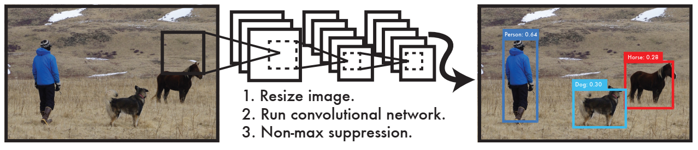
	
	图1. YOLO检测系统 使用YOLO处理图像非常简单明了。 我们的系统（1）将输入图像的大小调整为448×448，（2）在图像上运行单个卷积网络，并且（3）通过模型的置信度对检测结果进行阈值化
	
	YOLO非常简单：观看图1。一个卷积神经网络同时预测多个边界框以及他们的类别概率。YOLO在整个图像上训练，直接优化检测性能。与传统的目标检测方法相比，这个用以模型有几个优点。
	
	首先，YOLO非常快速。因为，我们将系统构建为了一个回归问题，不需要复杂的流水线。我们只需在测试时在新图像上运行神经网络即可预测检测结果。在没有使用批处理的Titan X GPU上，我们的基础模型能够达到每秒钟45帧，快速版本能够达到每秒钟150帧。这意味着，我们可以以低于25毫秒的延迟处理实时视频流。此外，YOLO达到了其他实时系统平均平均精度的两倍以上。我们的一个系统demo运行在实时的网络摄像头上，请登录网址http://pjreddie.com/yolo/观看我们的项目。
	
	第二，在对图片进行预测时，YOLO会对图片进行全局推理。与滑动窗口以及基于候选区域的技术不同，在训练和测试时，YOLO会观察整个图片以至于它能够隐式的编码有关图片类别上下文信息以及外观信息。Fast R-CNN是一种顶级检测方法[14]，但是由于看不到较大的上下文信息，因此容易将将图像中的背景色块误认为是对象。与Fast RCNN相比，YOLO模型的背景识别错误率只有其一半。
	
	第三，YOLO学习到能够泛化的对象表示。当使用自然图像训练之后，使用艺术作品测试，YOLO在很大程度上由于当前DPM以及RCNN等顶级检测模型。既然，YOLO模型具有高度的泛化性能，因此在应用于新的领域或者遇到异常的输入时，失败的可能性较小。
	
	YOLO在准确度上仍然落后于最新的检测系统。虽然YOLO能够快速的识别图片中的物体，但是它很难精确的定位一些目标，尤其是一些小目标。在我们的实验中进一步测试了这些权衡。
	
	我们所有的训练和测试代码都是开源的。各种与训练好的模型也提供下载。
	
## 2. 统一检测
	我们统一目标检测系统中的各个分散的组件到一个单一的神经网络中。我们的网络使用整个图片的特征去预测每一个边界框。模型可以同时预测一张图片中所有边界框中的所有的类别。这意味着我们的模型可以推理预测整张图片和图片中的所有目标。YOLO被设计为可以进行端到端的训练以及实时的高速预测，同时能够保持较高的准确度。
	
	我们的图片将输入的系统划分为SXS的网格。如果一个目标的中心落到了一个网格中，那么这个网络就负责检测这个目标（物体）。
	
	每一个网格预测B个边界框以及这些边界框的置信度。这些置信度反映的是，模型对于边界框中包含一个目标对象以及它预测的边界框准确度的确信程度。形式上，我们将置信度定义为Pr(object)*IOU_pred^truth。如果在网格中没有目标对象存在，那么置信度应该是0。因此，我们希望置信度能够等于预测边界框和真实边界框的交并比（intersection over union，IOU）。
	
	每一个边界框包含5个预测：x,y,w,h以及置信度。其中，（x,y）表示相网格的中心坐标。W,h表示预测的相对于整张图片的边界框的宽度和高度。置信度预测表示预测边界框和真实边界框的IOU。
	
	每一个边界框也同时会预测C个可能的类别概率，Pr(Classi|Object)。这些概率是以网格包含检测对象为条件的条件概率。对于每个网格我们仅预测一组类别概率。不管边界框的数量。
	
	在测试阶段，我们将每个边界框的置信度乘以条件类别概率，Pr(Classi|Object) ∗ Pr(Object) ∗ IOU_pred^truth = Pr(Classi) ∗ IOU_pred^truth (1)，从而得到每个边界框特定类别的置信度。这些分数编码该类别出现在边界框中的概率以及预测的盒子包含对象的合适程度。
	
	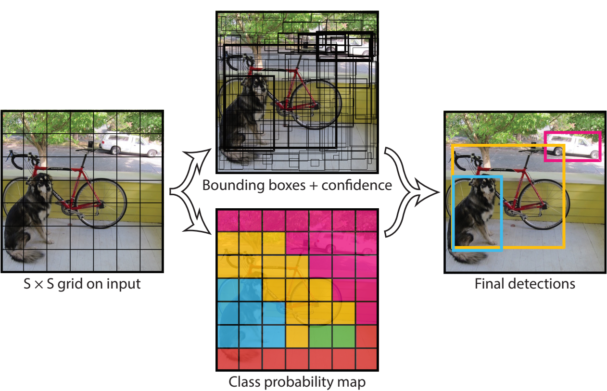
	
	图2 我们的系统将检测建模为回归问题。 它将图像划分为S×S网格，并为每个网格单元预测B边界框，这些框的置信度和C类概率。 这些预测被编码为S×S×（B * 5 + C）张量。
	
	为了评估YOLO在PASCAL VOC数据集上的表现，我们使S = 7，B =2。PASCAL VOC具有20个标记的类，因此C=20。我们的最终预测是7×7×30的张量。
### 2.1 网络设计
	我们通过卷积神经网络实现了该模型，并在PASCAL VOC检测数据集上对其进行评估[9]。网络的开始的卷积层从图像中提取特征，而全连接层则预测输出概率和坐标。
	
	我们的网络架构受到了图片分类模型GoogLeNet的启发。我们的网络由24个卷积层以及2个全连接层组成。我们只是用了1X1的降维层以及3X3的卷积层，而没有使用GoogLeNet的Inception层，这类似与Lin。完整的网络结构如图3所示。
	
	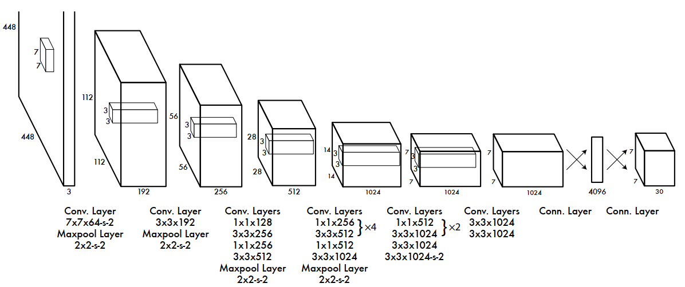
			
	图3 网路结构。检测网络由24个卷积层以及2个全连接层组成。交替的1X1的卷积层降低了前一层输出特征的维度。我们在ImageNet分类任务中以一半的分辨率（224×224输入图像）对卷积层进行预训练，然后将分辨率提高一倍进行测试。
	
	我们同时也训练了一个YOLO的快速版本，能够更快的进行目标检测。Fast YOLO使用了更少的卷积神经网络层（9层而不是24层）并且在卷积层中使用了更少的卷积核。除此之外，Fast YOLO和YOLO其他的训练以及测试参数是相同的。
	
	网络最终的输出7X7X30的预测张量。
	
### 2.2 模型训练
	我们在ImageNet1000个类别的竞赛数据集上对我们的卷积层进行预训练。为了进行预训练，我们使用图3结构中的前20个卷积层后加一个平均池化层以及一个全连接层。我们训练这个网络大约一周的时间，并且在ImageNet 2012 验证集上达到了单一裁剪(Single Crop)top-5 88%的精度，与Caffe Model Zoo中GoogLeNet的准确度相当。我们使用DarkNet 框架进行所有的训练和推断。
	
	然后，我们将模型进行转换以执行检测，Ren等人表明，将卷积层和连接层都添加到预训练的网络中可以提高性能[29]。按照他们的示例，我们添加了四个卷积层和两个完全连接的层，它们具有随机初始化的权重。检测通常需要细粒度的视觉信息，因此我们将网络的输入分辨率从224×224增加到448×448。
	
	我们最后一层同时预测类别概率以及边界框的坐标。我们通过图像的宽度和高度对边界框的宽度和高度进行归一化，使其位于0到1之间。我们将边界框的中心坐标x以及y参数化为某个特定网格的位置的偏移量，因此它们也被限制在0-1之间。
	
	我们在最后一层使用线性激活函数，其他层使用下面泄露的非线性整流单元：
	
	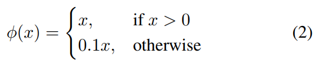
										
	我们在模型的输出使用平方和误差来优化我们的模型。我们之所以使用平方和误差是因为该误差函数易于优化，但是它并不完全符合我们实现平均精度最大化的目标。它对定位误差和分类误差的权重相等，这可能不恰当。此外，在每个图像中，许多网格单元都不包含任何对象。这就会使这些网格的置信度变为0，其反向传播时的梯度通常会超过确实包含对象的网格的梯度，这可能会导致模型不稳定，从而导致训练在早期就出现分歧。我们知道在训练过程中(loss逐渐降低)，不含目标的检测框其置信度向0收敛，包含目标的检测框的置信度向1收敛。由于最终的98个检测框中，大部分均不含目标，所以这种noobj的检测框在loss中占的比重更大，会导致其对总体loss下降的贡献也越大，使得包含目标的检测框向1收敛(训练的一个重要目的)的速度较慢。这不是我们想要的结果，因此对其设置权值可以有效地抑制这种情况的发生。
	
	为了解决这个问题，对于不包含对象的边界框，我们增加了边界框坐标预测的损失，并减少了置信度预测的损失。我们使用两个参数λ_coord  以及λ_noobj  来实现这个平衡。
	
	在平方和误差中同样对大边界框和小边界框的误差进行加权处理。我们的误差度量标准应该能够反映出，小边界框产生的小偏差应该比大边界框产生的小偏差更重要（因为小的边界框预测发生小的误差，对于小的目标而言都可能产生较大的预测误差）。为了能在一定程度上解决这个问题，模型预测的是边界框的高和宽的平方根，而不是直接预测边界框的宽和高。
	
	YOLO会在每个网格上预测多个边界框。在训练阶段，对于每一个目标，我们只需要一个边界框预测器负责预测。我们分配一个与真实边界框有最高交并比（IOU）的边界框来负责预测这个目标。这导致各个边界框预测器的专用化。 每个预测器都可以更好地预测某些大小，纵横比或对象类别，从而改善总体召回率。
	
	在训练期间，我们优化如下，有多个部分组成损失函数：
				
	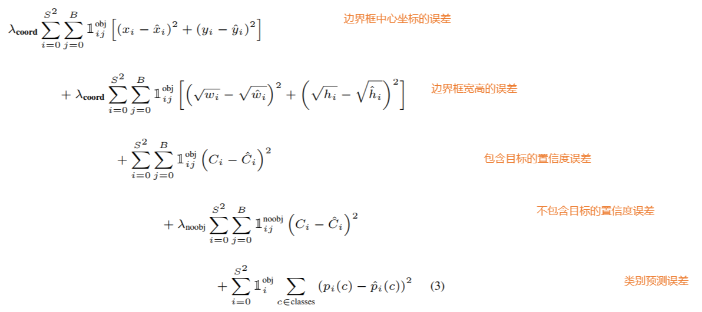
						
	此处，l_i^obj   表示目标出现在网格i中，l_ij^obj   表示网格i中的第j个边界框负责预测。
	
	请注意，如果该网格中存在目标对象，则损失函数只会惩罚分类错误（因此，前面讨论了条件分类概率）。如果预测边界框（与真实边界框具有最高的交并比IOU）“负责”真是边界框（ground truth box），损失函数只会对这个边界框的坐标误差进行惩罚。
	
	我们PASCAL VOC 2007和2012数据集的训练集以及验证集上将网络训练了135个迭代。训练时包含了VOC 2007的测试集，在测试时使用了VOC 2012测试集。在整个训练过程中我们使用的批量数据大小为64，角动量为0.9，权重衰减为0.0005。
	
	我们的学习率调整策略如下：在第一个迭代我们缓慢的将学习率从1e-3提升至1e-2。如果我们以较高的学习率开始训练，我们的模型通常会由于不稳定的梯度而发散。 我们继续以1e-2的学习率训练75个迭代，然后以1e-3的学习率训练30个迭代，最后以1e-4的学习率训练30个迭代。
	
	为了避免过拟合，我们使用了随机丢弃(dropout)以及广泛的数据增强。在第一个连接的层之后，dropout层以0.5的概率随机丢弃神经元，阻止了前后层之间的完全连接。就数据增强而言，我们引入了以原始图片尺寸的20%来进行随机缩放和平移。在HSV颜色空间中，我们还将图像的曝光和饱和度随机调整至最大1：5。
	
### 2.3 推断
	就像在训练中一样，预测测试图像的检测仅需要进行一次网络评估。在PASCAL VOC数据集上，网络在每张图片上预测98个边界框，以及每一个框中的类别概率。与基于分类器的方法不同，YOLO只需要进行一次网络评估，因此测试时间非常快。
	网格设计在边界框预测中加强了空间多样性。通常，目标对象落在哪一个网格中是非常清晰的，因此网络只会为每一个目标对象预测一个边界框。但是，一些大对象或多个单元格边界附近的对象可以被多个单元格很好地定位。非极大值抑制可以用来修复这些多个检测。虽然对性能并不像R-CNN或DPM那样重要，但非非极大值抑制能够是mAP增加2-3个点。
	
### 2.4 YOLO的局限
	由于每个网格只能预测两个边界框，只能有一个类别，所以YOLO在预测边界框时有很大的空间限制。这种空间限制限制了我们的模型可以预测的相邻物体的数量。 我们的模型那一检测成群出现的小目标，例如鸟群。
	
	由于我们的模型从数据中学会了预测边界框，因此很难将其泛化到具有新的或不同寻常的宽高比或配置的对象。由于在我们的模型结构对输入图片中使用了多个下采样层，因此我们的模型使用的是比较粗粒度的特征来预测边界框。
	
	最后，虽然我们训练损失函数，近似评估目标检测性能，但我们的损失函数对小边界框与大边界框中的误差的处理方式相同。 大边界框中的小误差通常是良性的，但小盒子中的小误差对交并比的影响却很大。 误差的主要来源是定位误差。
	
## 3. 与其他检测模型的对比
	目标检测时计算机视觉中的一个核心问题。检测流水线通常首先从输入图像中提取一组稳定的特征开始（Haar [25]，SIFT [23]，HOG [4]，卷积特征[6]）。然后，使用分类器[36、21、13、10]或定位器[1、32]来识别特征空间中的对象。这些分类器或定位器以滑动窗口的方式在整个图像上或图像的某些区域子集上运行[35、15、39]。我们将YOLO检测系统与几个顶级检测框架进行了比较，突出了关键的异同。
	
	可变形组件模型。可变形组件模型（DPM）使用滑动窗口来实现目标检测[10]。DPM使用不相交的管线来提取静态特征，对区域进行分类，预测高分区域的边界框等。我们的系统用单个卷积神经网络替换了所有这些不同的部分。 网络同时执行特征提取，边界框预测，非极大值抑制和上下文推理。与静态特征不同，网络在线训练特征并对其进行优化以执行检测任务。我们的统一体系结构带来了比DPM更快、更精确的模型。
	
	R-CNN. R-CNN及其变种使用区域建议而不是滑动窗口来查找图像中的对象。选择性搜索[35]生成潜在的边界框，卷积网络提取特征，支持向量机对框进行评分，线性模型调整边界框，非最大值抑制消除重复检测。这个复杂管道的每个阶段都必须精确地独立地进行调整，并且最终的系统非常慢，在测试时每个图像需要40秒以上的时间[14]。
	
	YOLO与R-CNN有一些相似之处。 每个网格单元都提出潜在的边界框，并使用卷积特征对这些框进行评分。但是，我们的系统在网格单元建议上施加了空间限制，这有助于减轻对同一对象的多次检测。我们的系统也提出了少得多的边界框，每幅图像只有98个，相比之下，选择性搜索大约有2000个。最后，我们的系统将这些单独的组件组合成一个单独的、联合优化的模型。
	
	其他的快速检测模型. Fast R-CNN以及faster R-CNN致力于通过共享计算和使用神经网络而不是选择性搜索来获得候选区域来加速R-CNN框架[14] [28]。尽管它们在R-CNN上提供了速度和准确性方面的改进，但两者仍然都缺乏实时性能。
	
	许多研究工作都集中在加快DPM流水线[31] [38] [5]上。 它们加快了HOG计算，使用级联并使用GPU来计算加速。 但是，实际运行只有30帧每秒。
	
	YOLO没有尝试优化大型检测管道的单个组件，而是完全抛弃了管道，设计速度很快。
	
	像面孔或人这样的单一类别的检测器可以进行高度优化，因为它们必须处理更少的变化[37]。 YOLO是一种通用检测器，可学习同时检测各种物体。
	
	Deep MultiBox. 与R-CNN不同，Szegedy等人提出，训练卷积神经网络来预测感兴趣区域[8]，而不是使用选择性搜索。通过将置信度预测替换为单个类别预测，MultiBox还可以执行单个对象检测。然而，MultiBox不能执行一般的目标检测，它仍然只是一个更大的检测管道中的一部分，需要进一步的图像补丁分类。YOLO和MultiBox都使用卷积网络来预测图像中的边界框，但YOLO是一个完整的检测系统。MUltiBox只是系统中的一部分。
	
	OverFeat. Sermanet等人。训练一个卷积神经网络来执行定位，并使该定位器执行检测[32]。OverFeat有效地执行滑动窗口检测，但它仍然是一个多组件的系统。OverFeat优化定位，而不是检测性能。与DPM一样，定位器在进行预测时只看到局部的信息。OverFeat不能对全局上下文进行推理，因此需要大量的后续处理来进行连续检测。
	
	MultiGrasp. 我们的工作在设计上类似于Redmon等人[27]的抓取检测工作。我们用于边界框预测的网格方法基于MultiGrasp系统。但是，抓取检测比对象检测要简单得多。MultiGrasp只需要为包含一个对象的图像预测单个可抓取的区域。 不必估计物体的大小，位置或边界或预测其类别，仅需找到适合抓取的区域即可。YOLO可以预测图像中多个对象的多个类别，边界框和类别概率。
	
## 4. 实验
	首先，我们将YOLO与其他的实时目标检测系统在PASCAL VOC2007数据集上进行对比。为了了解YOLO和R-CNN的变种模型之间的差异，我们探索了YOLO和Fast R-CNN（R-CNN的一个高性能版本）在VOC 2007上的误差[14]。基于不同的错误配置文件，我们证明了YOLO可用于对Fast R-CNN检测进行评分，并减少背景假阳性引起的错误，从而显着提高性能。我们还将介绍模型在VOC 2012的测试结果，并将mAP与当前的最新方法进行比较。 最后，我们证明了在两个艺术品数据集上，YOLO可以比其他目标检测模型具有更好地泛化能力。
	
### 4.1 与其他实时系统的对比
	在对象检测方面的许多研究工作都集中在快速建立标准检测流水线上。[5] [38] [31] [14] [17] [28]然而，只有Sadeghi等人的工作时实际上产生了一个能够实时运行的检测系统（每秒30帧或更高）[31]。我们YOLO模型与DPM的GPU实现进行对比，后者在30Hz或100Hz下运行。尽管其他的研究成果尚未达到实时检测的效果，但我们还比较了它们的相对mAP和检测速度，以测试目标检测系统中的精度-性能折衷。
	
	快速YOLO是PASCAL上最快的对象检测方法。 据我们所知，它是现存最快的目标检测系统。 凭借52.7％的mAP，它的准确度是以前实时检测工作的两倍以上。 YOLO将mAP提升至63.4％，同时仍然能够保持实时性能。
	
	我们还使用VGG-16训练YOLO。 该模型比YOLO更准确，但速度也要慢得多。 与其他依赖VGG-16的检测系统进行比较时，它很有用，但由于它比实时系统慢，因此本文的其余部分集中于我们的更快模型。
	
	Fastest DPM可以在不牺牲很多mAP的情况下有效地加快DPM的速度，但是它仍然将实时性能降低了2倍[38]。 与神经网络方法相比，DPM的检测精度也相对较低。
	
	没有R的R-CNN意味着使用静态边界框来代替选择性搜索。尽管它比R-CNN更快，但是仍然没有达到实时性，并且没有合适的边界框的话，准确性会受到影响。
	
	Fast R-CNN 加速了R-CNN的分类过程，但是，仍然依赖于选择性搜索，每张图片大约花2秒中来产生候选的边界框。因此，Fast R-CNN具有较高的mAP，但是，处理速度只有0.5帧每秒，远达不到实时效果。
	
	最近的Faster R-CNN使用神经网络来代替选择性搜索去找到候选边界框，与Szegedy 等人的工作类似。[8]在我们的测试中，他们最准确的模型可以达到7fps，而较小的，精度较低的模型则可以18fps运行。 Faster R-CNN的VGG-16版本的mAP能提高10个点，但比YOLO慢6倍。 ZeilerFergus Faster R-CNN仅比YOLO慢2.5倍，但同时准确性仍然较低。
	
	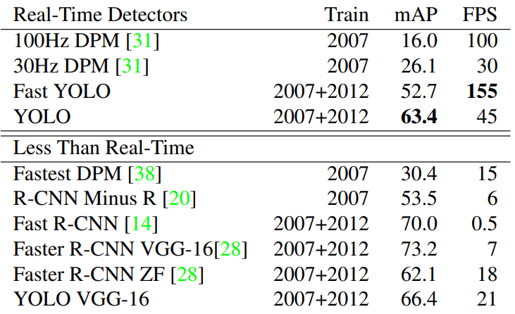
								
	表1 实时检测系统在PASCAL VOC 2007数据集上的检测结果。比较了目标检测系统之间的性能与速度。Fast YOLO是PASCAL VOC数据集上检测速度最快的目标检测模型，准确度是其他目标检测模型的两倍。YOLO的mAP比Fast版本高了10个百分点。
	
### 4.2 VOC2007数据集误差分析
	为了进一步检验YOLO与最新目标检测模型之间的差异，我们详细查看了在VOC2007上的实验结果。我们拿YOLO与Fast RCNN进行了比较，因为Fast R-CNN是PASCAL上性能最高的检测器之一，并且其检测是公开的。
	
	我们使用Hoiem等人的方法和工具。 [19]对于测试阶段中的每个类别，我们查看该类别的top N个预测。每一个预测要么是正确的，要么根据误差类型进行分类：
		Ø 正确：正确分类且交并比IOU > 0.5
		Ø 定位误差：分类正确且 0.1 < IOU < 0.5
		Ø 相似：各类别相似，IOU > 0.1
		Ø 其他：分类错误，IOU > 0.1
		Ø 背景：任何对象的 IOU < 0.1
	图4显示了在所有的20个类别上每种错误类型平均值的分解图。
							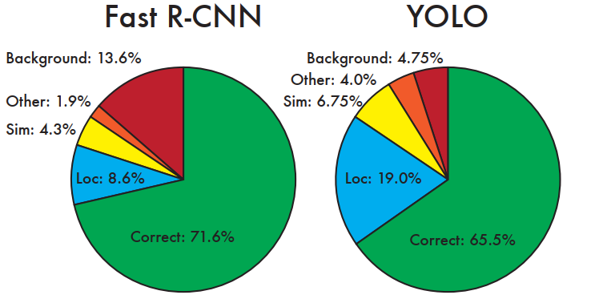
	
									图4 误差分析：Fast R-CNN VS YOLO 上述两图展示了在Top N检测中的定位和背景误差
	YOLO仍然需要提高定位精度。定位误差占YOLO总误差的比例超过了所有其他来源的总和。Fast R-CNN的定位误差更小一些，但是背景误差很大。Top-N检测中有13.6%不包含任何对象，但是被识别为对象。Fast R-CNN的背景识别误差是YOLO的三倍。
	
### 4.3 Fast R-CNN与YOLO结合
	与Fast R-CNN相比，YOLO产生的背景误差少得多。通过使用YOLO来消除Fast R-CNN的背景检测误差，我们可以显著提高性能。对于R-CNN预测的每个边界框，我们都会检查YOLO是否预测了类似的边界框。如果是这样，我们将根据YOLO预测的概率和两个框之间的重叠来对该预测进行增强。最佳的Fast R-CNN模型在VOC 2007测试集上的mAP达到71.8％。 与YOLO结合使用时，其mAP增长3.2％，达到75.0％。我们还尝试将最好的Fast R-CNN模型与Fast R-CNN的其他几个版本结合使用。 这些组合模型的mAP在0.3%和0.6％之间有小幅增加，有关详细信息，请参见表2。
		
		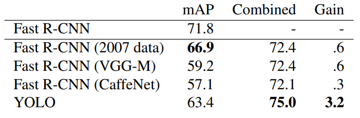
								
	表2 VOC2007上的模型组合实验 我们测试了将其他几个Fast R-CNN模型与最好的Fast R-CNN组合的效果，发现其他版本的Fast R-CNN只能带来很小性能提升，但是YOLO能够带来可观的性能提升。
	
	YOLO带来的性能提升不仅仅是模型融合带来的副产品，因为并不是与所有版本的R-CNN融合都能带来性能的提升。准确的说，因为YOLO在训练阶段产生的各种错误，提升了Fast R-CNN的性能。
	
	不幸的是，这种组合无法从YOLO的快速检测中受益，因为我们分别运行每个模型，然后组合结果。 但是，由于YOLO如此之快，与Fast R-CNN相比，它不会增加任何计算负担。
	
### 4.4 VOC2012上的测试结果
	在VOC2012的测试集上，YOLO的mAP达到了57.9%。低于当前的最新检测模型，接近于使用VGG-16作为骨干的R-CNN，详见图3。与其它相似的模型相比，我们的模型难以检测小物体。在瓶子、绵羊和电视/监视器等类型的物体识别中，YOLO的得分比R-CNN或Feature Edit低8-10%。然而，在其他类别，如猫和火车，YOLO取得了更高的表现。
	
	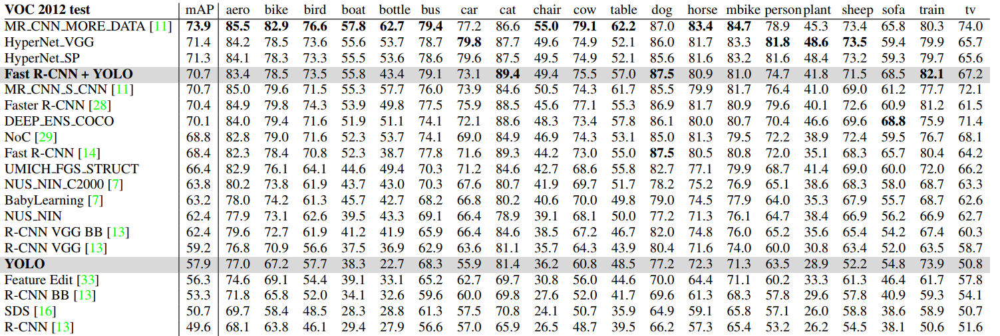
	
	表3 PASCAL VOC2012 排行榜 截至2015年11月6日，YOLO与完整的comp4（允许外部数据）公共排行榜进行了比较。显示了各种检测方法的mAP精度和每类平均精度。 YOLO是唯一的实时检测器。 Fast R-CNN + YOLO是得分最高的方法，比Fast R-CNN高2.3％。
	
	我们的Fast R-CNN + YOLO组合模型是性能最高的检测方法之一。 Fast R-CNN与YOLO的组合使性能提高了2.3％，在公共排行榜上的排名上升了5位。
	
### 4.5 泛化能力：艺术品中的任务检测
	用于目标检测的学术数据集从同一分布中提取训练集和测试集。在实际的应用中，很难预测所有可能的用例，并且测试数据可能会与系统之前训练时用到的数据有所不同[3]。Picasso数据集[12]和People-Art数据集[3]上（这两个数据集用于测试艺术品上的人物检测），我们将YOLO与其他检测系统进行比较。
	
	图5展示了YOLO与各个模型的性能比较，作为参考基准，我们给出了各个模型在VOC 2007上训练，并且预测人物的AP指标。各个模型在VOC2012上训练，在Picasso数据集上预测，在VOC2010数据集上训练，在People-Art数据集上预测。
	
	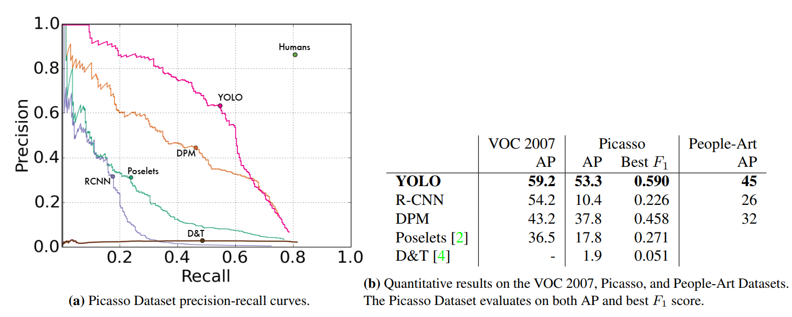
										图5 关于Picasso和People-Art数据集上的泛化结果。
	
	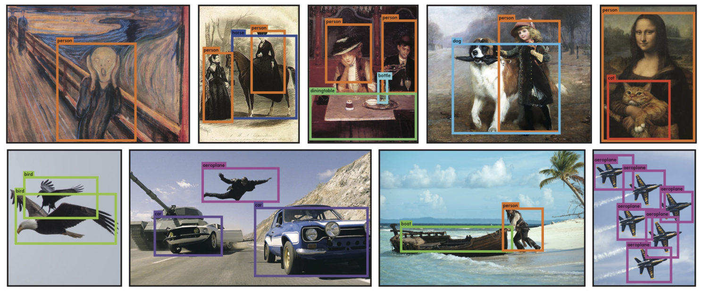
					图6 定性结果。 YOLO运行样本作品和来自互联网的自然图像。 尽管它确实认为一个人是一架飞机，但大多数情况下都是准确的。
	
	R-CNN在VOC 2007上具有较高的AP。但是，R-CNN在应用于艺术品数据集上预测时会性能大幅下降。 R-CNN将“选择性搜索”用于候选边界框的选择，该建议针对自然图像进行了调整。 R-CNN中的分类器步骤只能看到很小的区域，并且依赖于好的候选边界框。
	
	当DPM应用于艺术品数据集检测时，可以很好地保持其AP。 现有的工作理论认为DPM表现良好，时因为它具有强大的对象布局和空间形状的学习能力。 尽管DPM的AP衰减程度不如R-CNN那样大，但它的AP起点较低。
	
	YOLO在VOC 2007上具有良好的性能，并且在应用于艺术品时，其AP的降级比其他方法要少。 与DPM一样，YOLO对对象的大小和形状以及对象之间的关系以及对象通常出现的位置进行建模。艺术品和自然图像在像素级别上有很大差异，但是在对象的大小和形状方面相似，因此YOLO仍可以预测良好的边界框和检测。
## 5. 外部环境实时检测
	YOLO是一种快速，准确的物体检测器，非常适合计算机视觉应用。我们将YOLO连接到网络摄像机，计算从摄像机获取图像并显示检测结果的时间，来验证它是否保持实时性能。
	
	最终的系统是互动的且引人入胜的。YOLO单独处理图像时，将其附加到网络摄像头后，其功能类似于跟踪系统，可以检测到物体移动和外观变化。该系统的演示和源代码可以在我们的项目网站上找到：http://pjreddie.com/yolo/。
	
## 6.结论
	我们提出的YOLO是一个统一的端到端的目标检测模型。我们的模型易于构建，且在整个图片上进行训练。与基于分类器的方法不同，YOLO在一个损失函数上训练，这个损失函数直接与检测性能相关，整个模型在一起训练。
	
	Fast YOLO文献中最快的通用目标检测模型，YOLO推动了实施目标检测系统的发展。YOLO可以很好的泛化到新的领域，使其成为应用的快速，稳定的目标检测模型。
	
	致谢：这项工作得到了ONR N00014-13-1-0720，NSF IIS-1338054和艾伦杰出研究者奖的部分支持。
	

